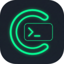

# Console Log Copier

A Chrome extension that captures console logs with **full object serialization** - no more truncated `[Object]` in your copied logs. Filters out React/Node framework noise so you only get your actual console statements.

## Features

- **Deep Object Serialization** - Captures all nested fields, no truncation
- **Smart Filtering** - Automatically filters out:
  - React warnings and errors
  - Hydration errors
  - HMR/Hot Module Replacement messages
  - Webpack/Vite/Next.js dev noise
  - Framework internal logs
- **Filter by Level** - Toggle log/info/warn/error/debug
- **Multiple Formats** - Pretty JSON, Compact JSON, or Plain Text
- **Copy Individual or All** - Copy single entries or all logs at once
- **Stack Traces for Errors** - Only shows stack traces for error-level logs

## Installation

1. Clone this repository:
   ```bash
   git clone https://github.com/NickAnthony/console-log-copier.git
   ```

2. Open Chrome and go to `chrome://extensions/`

3. Enable **Developer mode** (toggle in top right)

4. Click **Load unpacked**

5. Select the `chrome-extension` folder

## Usage

1. Navigate to any website
2. Open the browser console and use `console.log()`, `console.error()`, etc.
3. Click the extension icon in Chrome toolbar
4. View captured logs with full object data
5. Click **Copy All** to copy to clipboard

## Supported Console Methods

- `console.log()`
- `console.info()`
- `console.warn()`
- `console.error()`
- `console.debug()`
- `console.table()`
- `console.dir()`

## Special Type Handling

The extension properly serializes:
- Nested objects (unlimited depth)
- Arrays
- Dates (ISO string format)
- RegExp
- Map and Set
- Error objects (with stack traces)
- Circular references (detected and marked)
- DOM elements (tagged representation)

## Permissions

This extension requires:
- **activeTab** - Access the current tab to inject the console interceptor
- **scripting** - Inject scripts into pages to capture console output
- **storage** - Store captured logs per tab
- **clipboardWrite** - Copy logs to clipboard

The extension only activates on the current tab and does not send any data externally.

## Contributing

Contributions are welcome! Feel free to open issues or submit pull requests.

## License

MIT
