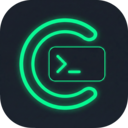

# Console Log Copier

A Chrome extension that captures console logs with **full object serialization** - no more truncated `[Object]` in your copied logs. Filters out React/Node framework noise so you only get your actual console statements.

Includes an **MCP server** so AI coding tools (Claude Code, Cursor, etc.) can query your browser's console logs programmatically.

## Features

- **Deep Object Serialization** - Captures all nested fields, no truncation
- **Smart Filtering** - Automatically filters out:
  - React warnings and errors
  - Hydration errors
  - HMR/Hot Module Replacement messages
  - Webpack/Vite/Next.js dev noise
  - Framework internal logs
- **Filter by Level** - Toggle log/info/warn/error/debug
- **Multiple Formats** - Pretty JSON, Compact JSON, or Plain Text
- **Copy Individual or All** - Copy single entries or all logs at once
- **Stack Traces for Errors** - Only shows stack traces for error-level logs
- **MCP Server** - Query console logs from AI coding tools via the Model Context Protocol

## Installation

### Chrome Extension

1. Clone this repository:
   ```bash
   git clone https://github.com/NickAnthony/console-log-copier.git
   ```

2. Open Chrome and go to `chrome://extensions/`

3. Enable **Developer mode** (toggle in top right)

4. Click **Load unpacked**

5. Select the `chrome-extension` folder

### MCP Server (optional)

The MCP server lets AI tools like Claude Code and Cursor query your browser's console logs. The extension works fine without it.

Add to your MCP config:

**Claude Code** (`.mcp.json` in your project root):
```json
{
  "mcpServers": {
    "console-logs": {
      "type": "stdio",
      "command": "npx",
      "args": ["-y", "console-log-mcp-server"]
    }
  }
}
```

**Cursor** (`~/.cursor/mcp.json`):
```json
{
  "mcpServers": {
    "console-logs": {
      "command": "npx",
      "args": ["-y", "console-log-mcp-server"]
    }
  }
}
```

That's it — the Chrome extension auto-connects to the MCP server via WebSocket on `localhost:18462`. No additional setup needed.

### MCP Tools

| Tool | Description |
|------|-------------|
| `list_active_pages` | List all pages with active sessions (URL, title, log count) |
| `get_console_logs` | Get logs from the most recent page load for a URL (supports partial match like `localhost:2001`) |
| `get_console_errors` | Get only errors from the most recent page load for a URL |
| `get_session_history` | List recent page load sessions for a URL |
| `get_logs_by_session` | Get logs from a specific session ID |
| `clear_logs` | Clear logs for a URL or all logs |

### Typical AI workflow

```
1. list_active_pages        → sees localhost:2001 (47 logs), localhost:2002 (12 logs)
2. get_console_logs("localhost:2001")  → gets all 47 logs from the latest page load
3. get_console_errors("localhost:2001") → just the errors
4. *reload page in browser*
5. get_console_logs("localhost:2001")  → only logs from the new page load
```

Each page navigation/reload creates a new session, so you always get clean logs from one page load.

## Usage

1. Navigate to any localhost page
2. Open the browser console and use `console.log()`, `console.error()`, etc.
3. Click the extension icon in Chrome toolbar
4. View captured logs with full object data
5. Click **Copy All** to copy to clipboard

## Supported Console Methods

- `console.log()`
- `console.info()`
- `console.warn()`
- `console.error()`
- `console.debug()`
- `console.table()`
- `console.dir()`

## Special Type Handling

The extension properly serializes:
- Nested objects (unlimited depth)
- Arrays
- Dates (ISO string format)
- RegExp
- Map and Set
- Error objects (with stack traces)
- Circular references (detected and marked)
- DOM elements (tagged representation)

## Permissions

This extension requires:
- **activeTab** - Access the current tab to inject the console interceptor
- **storage** - Store captured logs per tab
- **clipboardWrite** - Copy logs to clipboard
- **webNavigation** - Detect page loads to create log sessions for the MCP server

The extension only activates on localhost pages and does not send any data externally. The MCP server runs locally and stores logs in `~/.console-log-mcp/`.

## Contributing

Contributions are welcome! Feel free to open issues or submit pull requests.

## License

MIT
